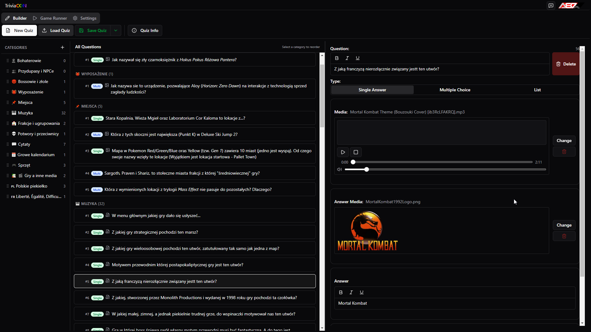
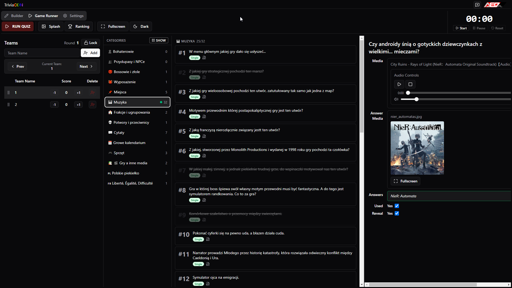
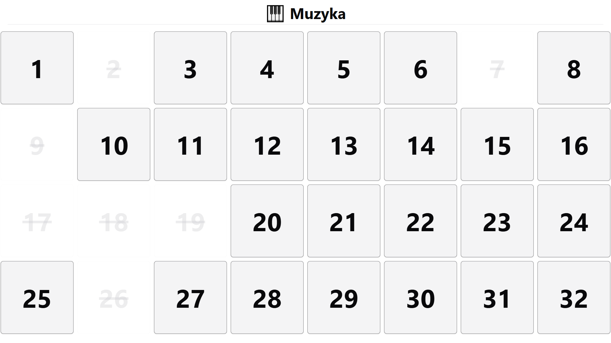
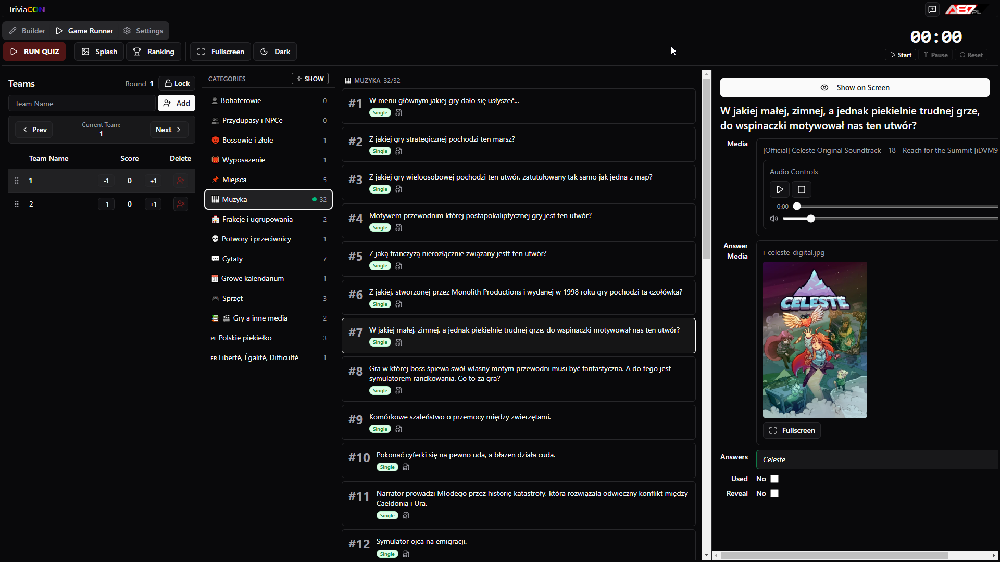
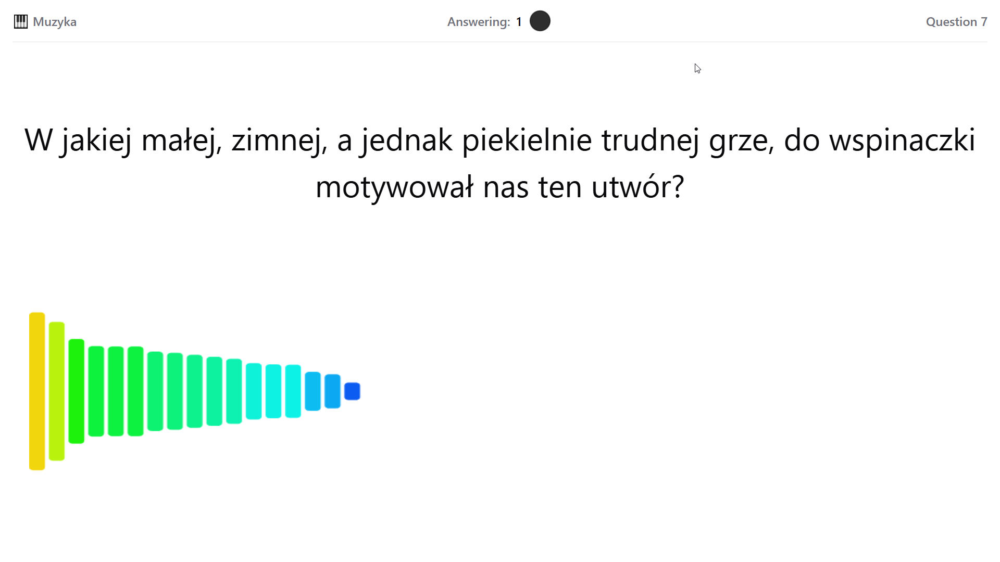
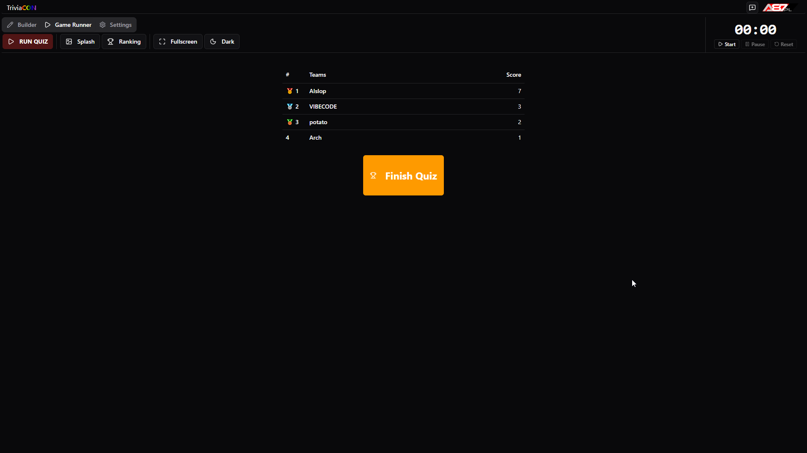
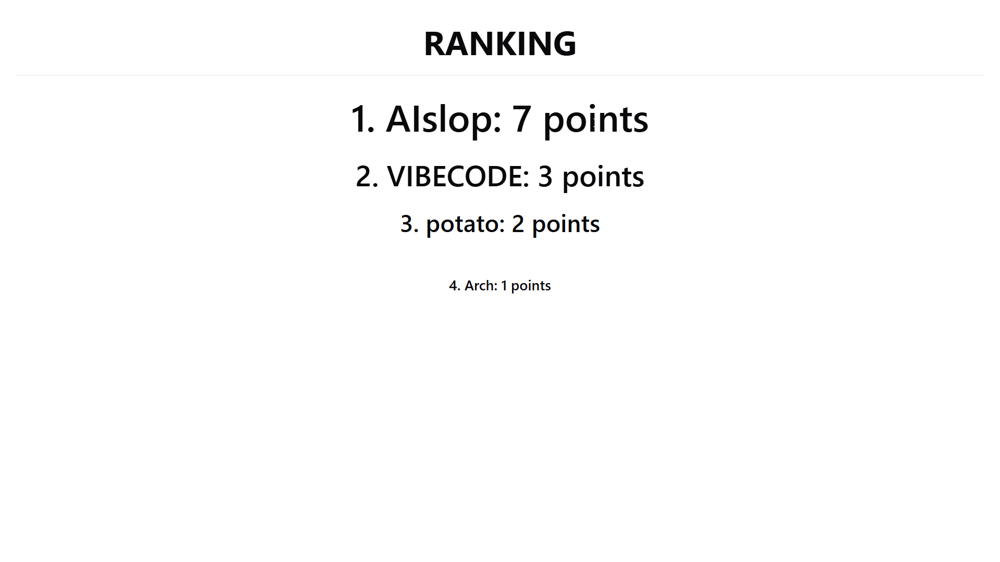

# Triviacon

> Przenośna aplikacja do prowadzenia quizów na żywo — a portable live quiz host for events.

Triviacon is a self-contained desktop app for running trivia quiz nights. The host drives the game from a **control panel** while contestants follow along on a separate **game screen** — a projector, TV, or second monitor. One machine, two displays, no networking.

## Screenshots

Every phase has two views: what the **host** sees on the control panel, and what the **audience** sees on the game screen.

### Builder — write your quiz

Categories, rich-text questions, answer options, and optional media (image, audio, or video) per question.



### Category board

The host picks the next question; the audience sees a live board of what's been played.

| Control panel | Game screen |
|---|---|
|  |  |

### A question

Media plays on the game screen. The `audio-only` flag hides the video and shows a visualizer instead — so a clip never gives the answer away.

| Control panel | Game screen |
|---|---|
|  |  |

### Final ranking

Manual scoring throughout, then a staged reveal of the standings.

| Control panel | Game screen |
|---|---|
|  |  |

## Download

Grab the latest build for your platform from the [Releases page](https://github.com/TriviaCon/triviacon/releases/latest):

| Platform | File |
|---|---|
| Windows | `Triviacon-x.x.x-win.zip` — extract and run `triviacon.exe` |
| Linux | `Triviacon-x.x.x.AppImage` — `chmod +x`, then run |
| macOS | `Triviacon-x.x.x-mac.zip` — extract and run `Triviacon.app` |

No installation required. Triviacon is fully portable — run it from a USB drive, a shared folder, or anywhere you like, and it leaves no trace on the host machine.

## Running a quiz night

1. **Launch Triviacon** — the control panel opens automatically.
2. **Open or create a quiz file** (`.tcq`) from the toolbar.
3. **Build your quiz** in the Builder tab — categories, questions, answers, and optional media.
4. **Set up teams** in the Runner tab before you start.
5. **Open the game screen** — click the monitor icon and point a projector or second display at it.
6. **Run the game** — pick questions from the control panel; reveal answers, award points, and track standings live.

Quizzes are saved as `.tcq` files — a ZIP archive holding the quiz data and all attached media, so they're self-contained and easy to share.

The interface is available in **Polish** and **English**; switch languages in the Settings tab.

## Reporting issues & suggestions

Found a bug or have an idea? [Open an issue](https://github.com/TriviaCon/triviacon/issues) and include what you were trying to do, what happened instead, and your OS and Triviacon version.

## For developers

**Prerequisites:** [Node.js](https://nodejs.org/) v22+ and [pnpm](https://pnpm.io/) v10+ (`npm i -g pnpm` or via [Corepack](https://pnpm.io/installation#using-corepack)). This project uses pnpm exclusively — `npm install` is blocked by a `preinstall` guard to avoid lockfile drift.

```bash
git clone https://github.com/TriviaCon/triviacon.git
cd triviacon
pnpm install
pnpm dev          # dev mode with hot reload (both windows)
```

> **`Error: Electron uninstall` on `pnpm dev`?** Electron's postinstall download was skipped. Run `node node_modules/electron/install.js`, or if that fails, `rm -rf node_modules ~/.cache/electron && pnpm install`.

Other scripts:

```bash
pnpm build:win     # Windows (zip)
pnpm build:mac     # macOS (zip, x64 + arm64)
pnpm build:linux   # Linux (AppImage)
pnpm typecheck     # TypeScript (node + web configs)
pnpm test          # Vitest
pnpm lint          # ESLint with autofix
pnpm format        # Prettier
```

**Tech stack:** [Electron](https://www.electronjs.org/) · [React 19](https://react.dev/) + [TypeScript](https://www.typescriptlang.org/) · [Tailwind CSS v4](https://tailwindcss.com/) + [Radix UI](https://www.radix-ui.com/) · [TanStack Query](https://tanstack.com/query) · [i18next](https://www.i18next.com/) · [yazl](https://github.com/thejoshwolfe/yazl) / [adm-zip](https://github.com/cthackers/adm-zip) for `.tcq` packaging.

## License

Triviacon's code is released under the [MIT License](LICENSE) — © 2026 Marcin "Aluś" Jędrecki. Use it, fork it, build on it.

The *idea* of a trivia-night host isn't anyone's to own — others surely exist; this is just my take on it. If Triviacon inspired your own build, a nod back is appreciated, never required.

**Third-party assets.** The bundled ranking fanfares — "Victory" (Final Fantasy V) © Square Enix, Pokémon Gen 1 © Nintendo / Game Freak, and the NFL on Fox theme © Fox — remain the property of their respective owners and are **not** covered by the MIT license.
