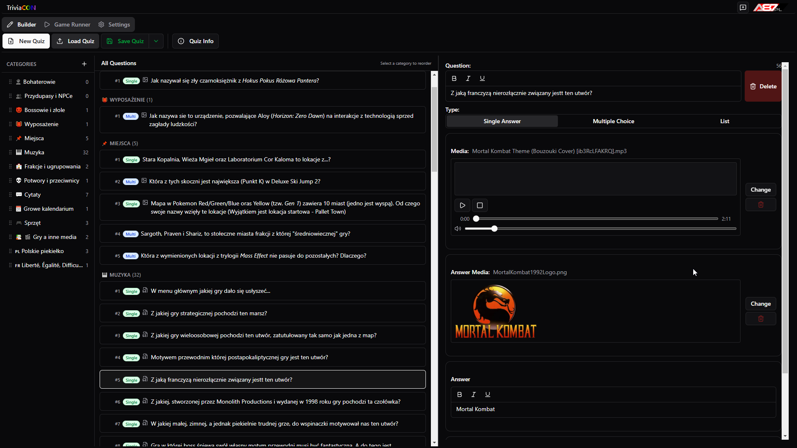
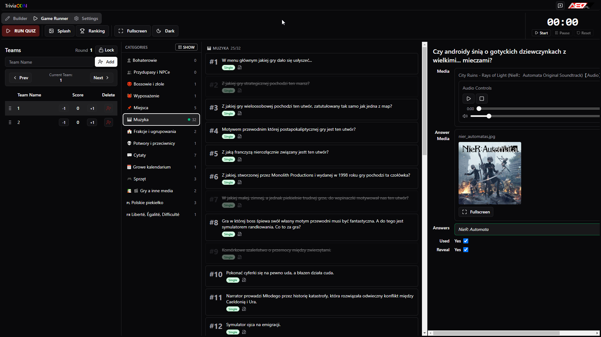
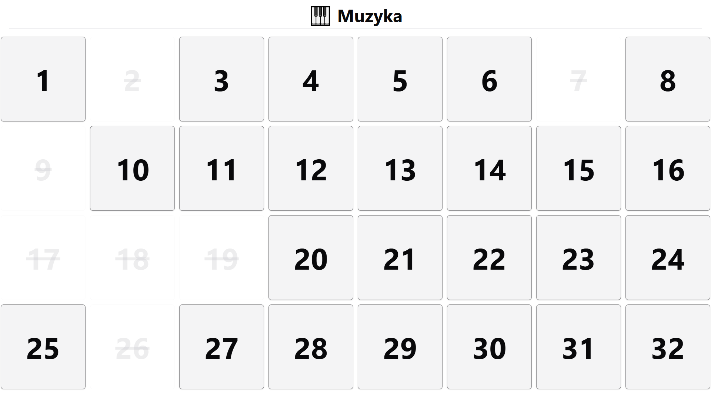
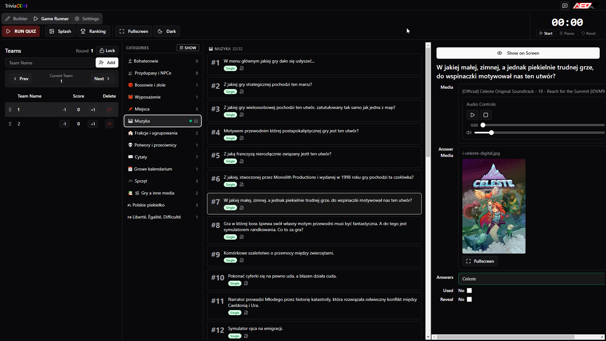
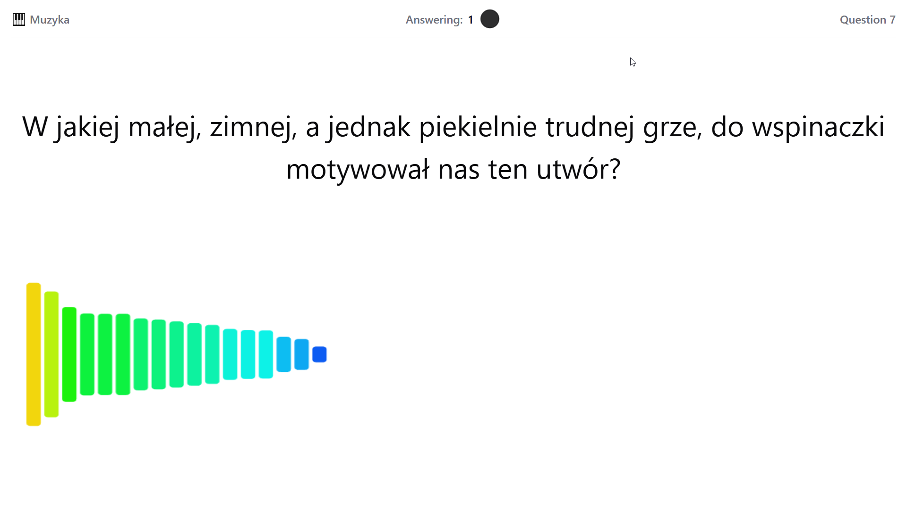
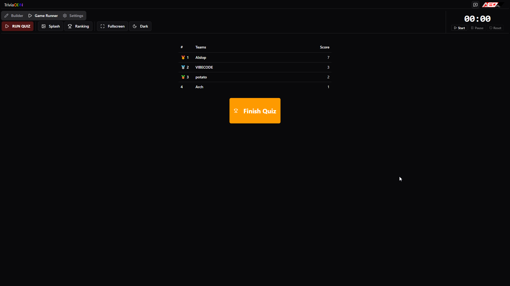
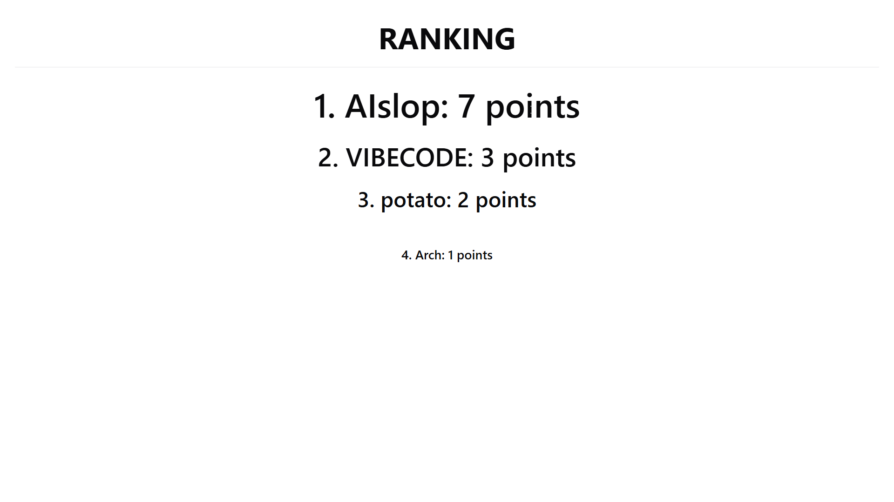

# TriviaCON

> A portable live quiz host for events.

TriviaCON is a self-contained desktop app for running trivia quiz nights. The host drives the game from a **control panel** while contestants follow along on a separate **game screen** — a projector, TV, or second monitor. One machine, two displays, no networking.

Write your quiz once, save it as a single shareable file, and host the whole night from one window. Scoring stays in your hands — the app never guesses who was right.

## Features

- **Three question types.** *Single-answer* (one fixed answer, revealed as-is), *multiple-choice* (a set of lettered options, one correct), and *list* (a numbered set of items revealed one-by-one as the audience names them).
- **Rich-text authoring.** Format questions and answer options — bold, emphasis, and more — with a built-in editor. Drag to reorder answer options.
- **Media per question.** Attach one image, audio clip, or video to any question. The `audio-only` flag hides the video and shows a visualizer instead — so a clip never gives the answer away.
- **Manual scoring.** You award and deduct points per team, live. The app never auto-scores, so a judgment call is always yours to make.
- **Jump anywhere, anytime.** Splash, category board, questions, and the final ranking are display states, not a fixed sequence — move between them freely as the night unfolds.
- **Self-contained quiz files.** Everything — questions, answers, and all attached media — lives in one portable `.tcq` file that's easy to back up and share.
- **Polish and English** interfaces, switchable in Settings — and fully localizable, so more languages can be added.

## Screenshots

Every phase has two views: what the **host** sees on the control panel, and what the **audience** sees on the game screen.

### Builder — write your quiz

Categories, rich-text questions, answer options, and optional media (image, audio, or video) per question.



### Category board

The host picks the next question; the audience sees a live board of what's been played.

| Control panel | Game screen |
|---|---|
|  |  |

### A question

Media plays on the game screen. The `audio-only` flag hides the video and shows a visualizer instead — so a clip never gives the answer away.

| Control panel | Game screen |
|---|---|
|  |  |

### Final ranking

Manual scoring throughout, then a staged reveal of the standings.

| Control panel | Game screen |
|---|---|
|  |  |

## Download

Grab the latest build for your platform from the [Releases page](https://github.com/TriviaCon/triviacon/releases/latest):

| Platform | File |
|---|---|
| Windows | `triviacon-x.x.x-win.zip` — extract and run `triviacon.exe` |
| Linux | `triviacon-x.x.x.AppImage` — `chmod +x`, then run |
| macOS | `triviacon-x.x.x-mac-x64.zip` or `-arm64` — extract and run `TriviaCON.app` |

No installation required. TriviaCON is fully portable — run it from a USB drive, a shared folder, or anywhere you like, and it leaves no trace on the host machine.

## Running a quiz night

1. **Launch TriviaCON** — the control panel opens automatically.
2. **Open or create a quiz file** (`.tcq`) from the toolbar.
3. **Build your quiz** in the Builder tab — categories, questions, answers, and optional media.
4. **Set up teams** in the Game Runner tab before you start.
5. **Open the game screen** — click the monitor icon and point a projector or second display at it.
6. **Run the game** — pick questions from the control panel; reveal answers, award points, and track standings live.

Quizzes are saved as `.tcq` files — a ZIP archive holding the quiz data and all attached media, so they're self-contained and easy to share.

The interface is available in **Polish** and **English**; switch languages in the Settings tab.

## Reporting issues & suggestions

Found a bug or have an idea? [Open an issue](https://github.com/TriviaCon/triviacon/issues) and include what you were trying to do, what happened instead, and your OS and TriviaCON version.

## Contributing

TriviaCON has a **deliberately narrow, fixed scope** — it's a single-machine, host-driven, manually-scored quiz tool, and it stays that way on purpose. Some things are permanent non-goals: networking and player devices, automatic scoring, automated game flow, AI-authored quiz content, and cloud/accounts/telemetry. The host is always in command, and the app leaves zero trace on the machine it runs on.

Bug fixes, translations, docs, and polish are very welcome. Before proposing a feature, please read **[CONTRIBUTING.md](CONTRIBUTING.md)** — it lays out the design principles and non-goals so a good idea doesn't turn into a rejected PR.

## For developers

> **Read [CONTRIBUTING.md](CONTRIBUTING.md) before you start coding.** TriviaCON has a deliberately narrow, fixed scope — the design principles and permanent non-goals there will save you from building something that can't be merged.

**Prerequisites:** [Node.js](https://nodejs.org/) v20–v25 (v22 LTS recommended — see `.nvmrc`; Node 26+ is not yet supported) and [pnpm](https://pnpm.io/) v10+ (`npm i -g pnpm` or via [Corepack](https://pnpm.io/installation#using-corepack)). This project uses pnpm exclusively — `npm install` is blocked by a `preinstall` guard to avoid lockfile drift.

```bash
git clone https://github.com/TriviaCon/triviacon.git
cd triviacon
pnpm install
pnpm dev          # dev mode with hot reload (both windows)
```

> **`Error: Electron uninstall` on `pnpm dev`?** You're on an unsupported Node version. On Node 26+, Electron's installer silently fails to unpack its binary — it exits successfully after extracting a single file, so `pnpm install` reports no error but leaves you without an Electron binary. Reinstalling won't help; you need to switch Node versions.
>
> Use [nvm](https://github.com/nvm-sh/nvm) to pick up the version pinned in `.nvmrc`:
>
> ```bash
> nvm install       # installs the version from .nvmrc
> nvm use
> rm -rf node_modules && pnpm install
> ```
>
> On Windows, [nvm-windows](https://github.com/coreybutler/nvm-windows) doesn't read `.nvmrc` — run `nvm install 22 && nvm use 22` instead.

Other scripts:

```bash
pnpm build:win     # Windows (zip)
pnpm build:mac     # macOS (zip, x64 + arm64)
pnpm build:linux   # Linux (AppImage)
pnpm typecheck     # TypeScript (node + web configs)
pnpm test          # Vitest
pnpm lint          # ESLint with autofix
pnpm format        # Prettier
```

**Tech stack:** [Electron](https://www.electronjs.org/) · [React 19](https://react.dev/) + [TypeScript](https://www.typescriptlang.org/) · [Tailwind CSS v4](https://tailwindcss.com/) + [Radix UI](https://www.radix-ui.com/) · [TipTap](https://tiptap.dev/) rich-text · [dnd-kit](https://dndkit.com/) drag-and-drop · [TanStack Query](https://tanstack.com/query) · [i18next](https://www.i18next.com/) · [Lucide](https://lucide.dev/) icons · [yazl](https://github.com/thejoshwolfe/yazl) / [adm-zip](https://github.com/cthackers/adm-zip) for `.tcq` packaging.

Architecture notes live in [CLAUDE.md](CLAUDE.md); the quiz content model is documented in [CONTEXT.md](CONTEXT.md).

## License

TriviaCON's code is released under the [MIT License](LICENSE) — © 2026 Marcin "Aluś" Jędrecki. Use it, fork it, build on it.

The *idea* of a trivia-night host isn't anyone's to own — others surely exist; this is just my take on it. If TriviaCON inspired your own build, a nod back is appreciated, never required.

**Third-party assets.** The bundled ranking fanfares — "Victory" (Final Fantasy V) © Square Enix, Pokémon Gen 1 © Nintendo / Game Freak, and the NFL on Fox theme © Fox — remain the property of their respective owners and are **not** covered by the MIT license.
